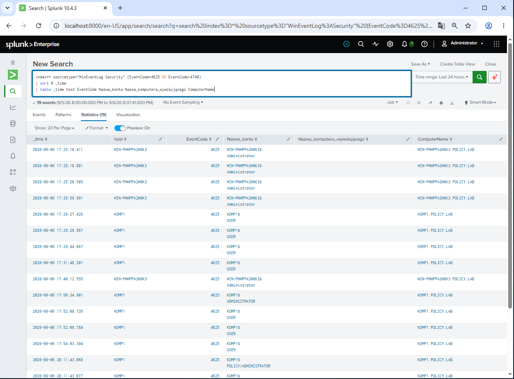
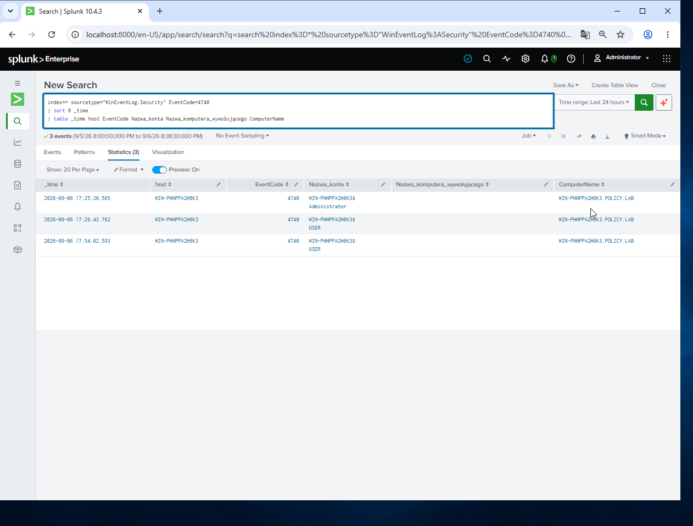
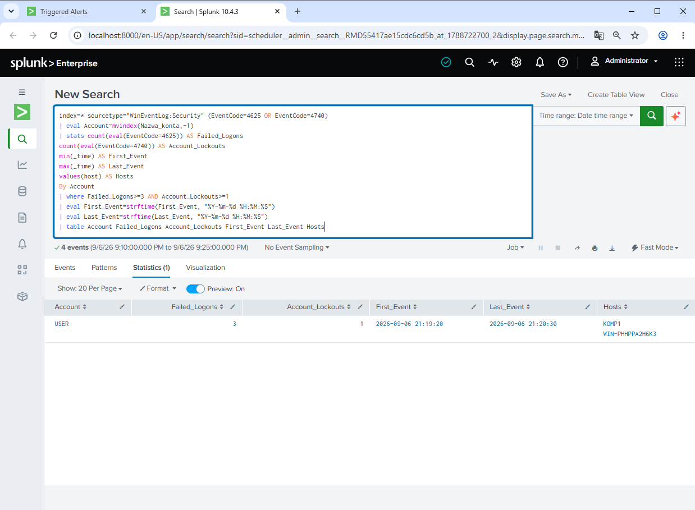
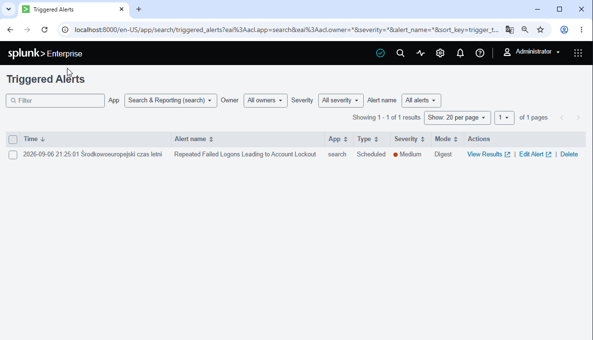

# Incident Report INC-001
## Repeated Failed Logons Leading to Account Lockout

### Incident Summary

A series of failed interactive logon attempts was detected for the domain account `USER`.

Three failed authentication attempts (Windows Event ID 4625) were observed on workstation `KOMP1`. The failed attempts were followed by an account lockout (Windows Event ID 4740) recorded by the Domain Controller.

Splunk correlated the events and triggered the detection:

**Repeated Failed Logons Leading to Account Lockout**

### Severity

**Medium**

### Environment

| Component | Details |
|---|---|
| Domain | `POLICY.LAB` |
| Workstation | `KOMP1` |
| Domain Controller | `WIN-PHHPPA2H6K3` |
| SIEM | Splunk Enterprise |
| Log Collection | Splunk Universal Forwarder |
| Operating Systems | Windows Server 2019 / Windows 10 |

### Evidence

| Field | Value |
|---|---|
| Account | `USER` |
| Failed Logons | 3 |
| Account Lockouts | 1 |
| Failed Logon Event ID | 4625 |
| Account Lockout Event ID | 4740 |
| First Event | 2026-09-06 21:19:20 |
| Last Event | 2026-09-06 21:20:30 |
| Source Workstation | `KOMP1` |
| Domain Controller | `WIN-PHHPPA2H6K3` |

#### Failed Logon Events — Event ID 4625

The following Splunk search shows failed Windows authentication attempts collected from the lab environment.

#### Account Lockout — Event ID 4740

The Domain Controller recorded account lockout events after repeated failed authentication attempts.

### Detection Logic

The Splunk detection searches for accounts with three or more failed logon events (Event ID 4625) and at least one subsequent account lockout event (Event ID 4740).

Events are correlated by account name.

#### Splunk Correlation Result

The detection correlated three failed logon events for account `USER` with one subsequent account lockout.

### Investigation

The investigation identified three failed authentication events associated with the domain account `USER` on workstation `KOMP1`.

After the repeated authentication failures, the configured domain account lockout policy was triggered.

The Domain Controller subsequently generated Event ID 4740 for the affected account.

Splunk collected the Windows Security events from both systems and correlated the failed authentication attempts with the account lockout.

### Classification

**Controlled Security Lab Simulation**

The activity was intentionally generated in an isolated lab environment to simulate repeated failed authentication attempts resulting in a domain account lockout.

### Response and Remediation

In a production environment, a SOC analyst should:

- Verify whether the authentication attempts were legitimate.
- Identify and investigate the source workstation.
- Review additional authentication activity associated with the account.
- Check whether other accounts show similar failed authentication patterns.
- Contact the affected user when appropriate.
- Reset or unlock the account only after validating the activity.
- Escalate the incident if malicious authentication activity is suspected.

### Outcome

The detection successfully identified three failed authentication attempts followed by an account lockout.

The scheduled Splunk alert triggered successfully and appeared in **Triggered Alerts** with **Medium** severity.

#### Triggered Alert

The detection was configured as a scheduled Splunk alert and successfully triggered after the simulated authentication activity.

**Detection status: Validated**
