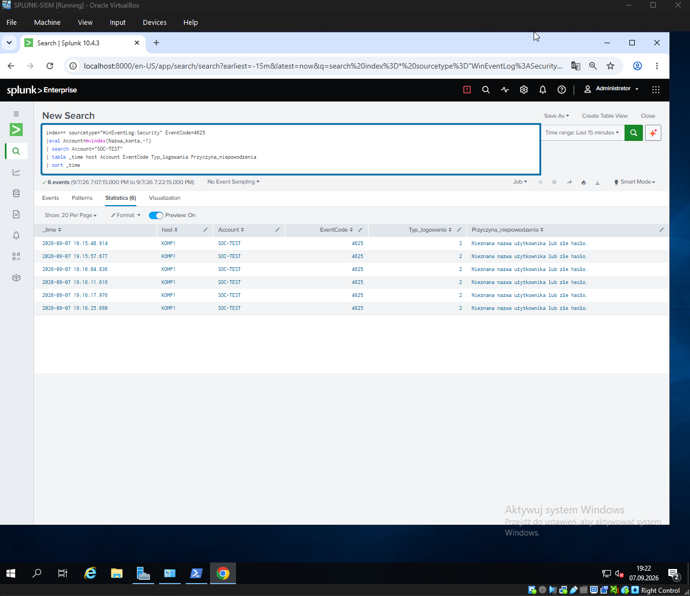
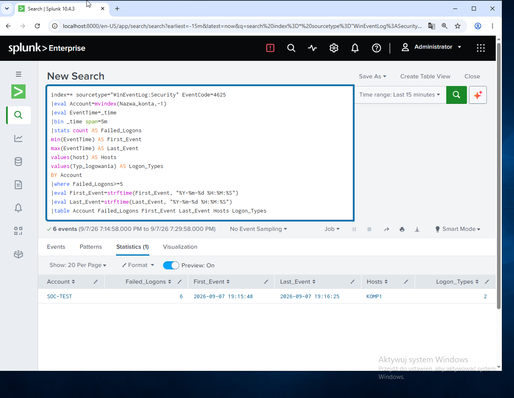
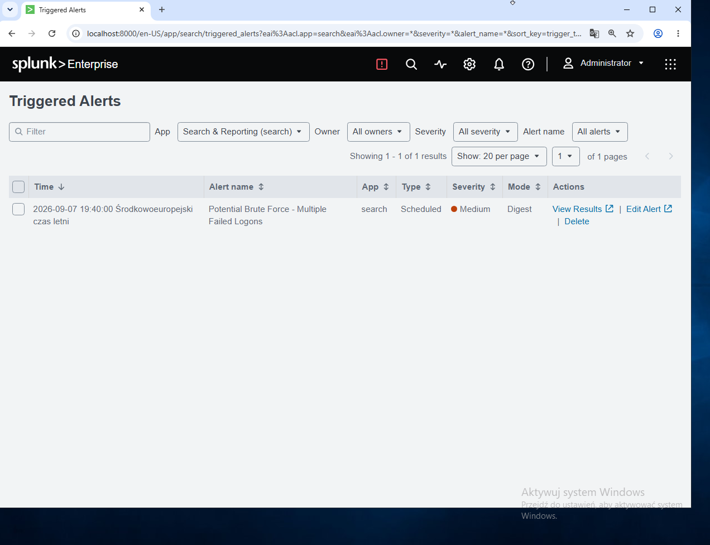
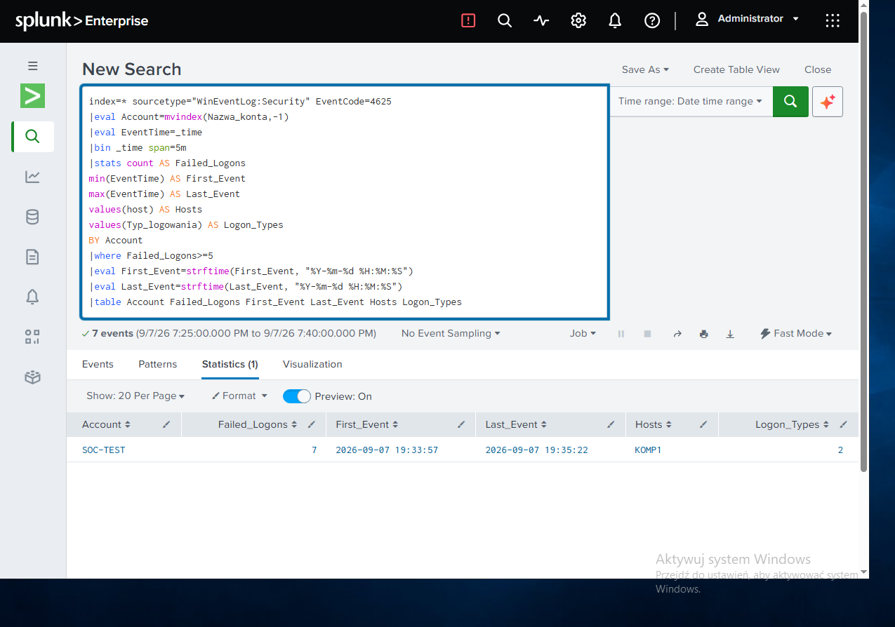

# Incident Report INC-002
## Potential Brute Force — Multiple Failed Logons

### Incident Summary

A series of repeated failed interactive logon attempts was detected for the domain account `SOC-TEST`.

Multiple Windows Event ID 4625 events were generated on workstation `KOMP1` within a short period of time.

The activity exceeded the configured Splunk detection threshold of five failed logon attempts and triggered the scheduled alert:

**Potential Brute Force - Multiple Failed Logons**

Unlike INC-001, this detection identifies suspicious authentication activity based on repeated failed logons without requiring an account lockout event.

### Severity

**Medium**

### Environment

| Component | Details |
|---|---|
| Domain | `POLICY.LAB` |
| Workstation | `KOMP1` |
| Test Account | `SOC-TEST` |
| SIEM | Splunk Enterprise |
| Log Collection | Splunk Universal Forwarder |
| Operating Systems | Windows Server 2019 / Windows 10 |

### Evidence

During the initial validation, six failed interactive logon attempts were generated for the test account.

| Field | Value |
|---|---|
| Account | `SOC-TEST` |
| Failed Logons | 6 |
| Event ID | 4625 |
| Logon Type | 2 — Interactive |
| First Event | 2026-09-07 19:15:48 |
| Last Event | 2026-09-07 19:16:25 |
| Source Workstation | `KOMP1` |

#### Failed Logon Events — Event ID 4625

Six failed authentication attempts were observed for the same domain account on workstation `KOMP1`.

### Detection Logic

The Splunk detection identifies accounts generating five or more failed Windows logon events within a five-minute time bucket.

The detection uses Windows Security Event ID 4625 and groups events by account name.

📄 [View Splunk detection rule](../detections/INC-002-brute-force.spl)

#### Splunk Detection Result

The detection identified six failed interactive logon attempts for `SOC-TEST` originating from `KOMP1`.

### Investigation

The investigation identified repeated Event ID 4625 authentication failures associated with the domain account `SOC-TEST`.

The events originated from workstation `KOMP1` and used Logon Type 2, indicating interactive logon attempts.

The failed authentication events occurred within a short period and exceeded the configured detection threshold.

No account lockout event was required for the detection to trigger. This allows suspicious authentication activity to be identified before an account necessarily reaches its lockout threshold.

### Classification

**Controlled Security Lab Simulation**

The activity was intentionally generated in an isolated Active Directory lab environment to simulate password guessing / potential brute-force authentication activity.

### Response and Remediation

In a production environment, a SOC analyst should:

- Verify whether the failed authentication attempts were legitimate.
- Identify the account and source workstation associated with the activity.
- Review additional authentication events before and after the detected activity.
- Determine whether similar attempts targeted other accounts.
- Check for successful authentication following the failed attempts.
- Contact the affected user when appropriate.
- Investigate the source host for additional suspicious activity.
- Escalate the incident if malicious authentication activity is suspected.

### Alert Validation

The detection was configured as a scheduled Splunk alert running every five minutes.

The alert successfully triggered with **Medium** severity after the simulated authentication activity exceeded the detection threshold.

#### Alert Results

The triggered alert identified seven failed logon events for `SOC-TEST` during the validation run.

### Outcome

The detection successfully identified repeated failed authentication attempts without relying on an account lockout event.

The scheduled Splunk alert triggered automatically and produced a result containing the affected account, number of failed logons, source host, event timestamps and logon type.

**Detection status: Validated**
