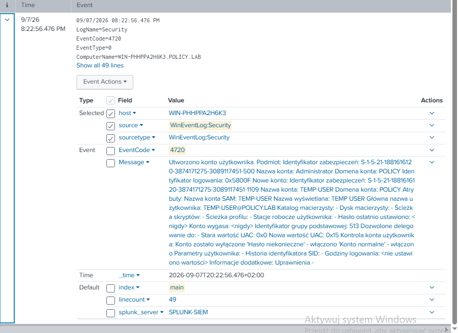
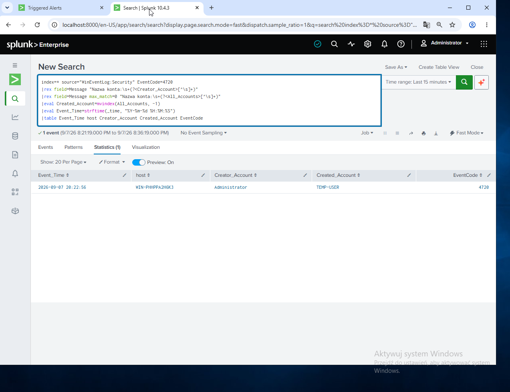
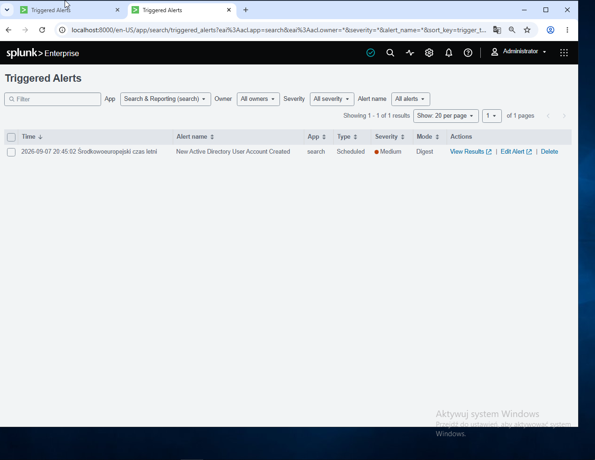
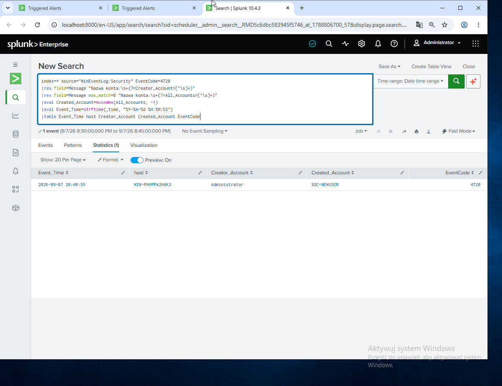

# Incident Report INC-003
## New Active Directory User Account Created

### Incident Summary

A new Active Directory user account creation event was detected in the `POLICY.LAB` domain.

Windows Security Event ID 4720 was generated on the Domain Controller when a new domain user account was created.

Splunk collected the event and extracted both the account responsible for the action and the newly created account.

The activity triggered the scheduled Splunk alert:

**New Active Directory User Account Created**

This detection provides visibility into account creation activity that may require investigation in a production Active Directory environment.

### Severity

**Medium**

### Environment

| Component | Details |
|---|---|
| Domain | `POLICY.LAB` |
| Domain Controller | `WIN-PHHPPA2H6K3` |
| SIEM | Splunk Enterprise |
| Log Collection | Splunk Universal Forwarder |
| Operating System | Windows Server 2019 |
| Windows Event ID | 4720 |

### Evidence

Windows Security Event ID 4720 was generated after a new Active Directory user account was created.

During the initial detection test, the `Administrator` account created the domain account `TEMP-USER`.

During the alert validation run, another account named `SOC-NEWUSER` was created to verify that the scheduled detection triggered automatically.

| Field | Value |
|---|---|
| Event ID | 4720 |
| Event Description | A user account was created |
| Creator Account | `Administrator` |
| Initial Test Account | `TEMP-USER` |
| Alert Validation Account | `SOC-NEWUSER` |
| Domain | `POLICY.LAB` |
| Domain Controller | `WIN-PHHPPA2H6K3` |

#### Windows Security Event — Event ID 4720

The raw Windows Security event collected by Splunk contains information about the account responsible for the action and the newly created Active Directory account.

### Detection Logic

The Splunk detection searches for Windows Security Event ID 4720, which indicates that a new user account was created.

Because the Windows event data was collected in Polish, the relevant account information was extracted from the `Message` field using `rex`.

The detection extracts both the account responsible for creating the user and the newly created account.

📄 [View Splunk detection rule](../detections/INC-003-new-account-created.spl)

#### Splunk Detection Result

The detection successfully extracted the account responsible for the action and the newly created account from Event ID 4720.

For the initial validation event:

- `Creator_Account`: `Administrator`
- `Created_Account`: `TEMP-USER`
- `EventCode`: `4720`

### Investigation

The investigation identified Windows Security Event ID 4720 on the Domain Controller.

The event indicated that the `Administrator` account created a new Active Directory user.

Splunk collected the Windows Security event through the Universal Forwarder and extracted the relevant account information from the event message.

The detection provides the SOC analyst with information about:

- when the account was created,
- which Domain Controller recorded the activity,
- which account performed the action,
- which new account was created.

In a production environment, creation of a new domain account should be validated against expected administrative activity or an approved change request.

Unexpected account creation may indicate unauthorized administrative activity or an attempt to establish persistence in the environment.

### Classification

**Controlled Security Lab Simulation**

The activity was intentionally generated in an isolated Active Directory lab environment to simulate and detect the creation of new domain user accounts.

### Response and Remediation

In a production environment, a SOC analyst should:

- Verify whether the account creation was authorized.
- Identify the administrator or process responsible for creating the account.
- Review the newly created account's group memberships and permissions.
- Check whether the account was added to privileged groups.
- Review authentication activity associated with the new account.
- Determine whether additional accounts were created during the same period.
- Disable the account if the activity cannot be validated.
- Escalate the incident if unauthorized account creation is suspected.

### Alert Validation

The detection was configured as a scheduled Splunk alert running every five minutes.

The alert successfully triggered with **Medium** severity after a new test account was created.

#### Alert Results

A separate test account, `SOC-NEWUSER`, was created to validate the scheduled alert.

The triggered alert successfully identified:

- `Creator_Account`: `Administrator`
- `Created_Account`: `SOC-NEWUSER`
- `EventCode`: `4720`

### Outcome

The detection successfully identified new Active Directory user account creation activity using Windows Security Event ID 4720.

Splunk extracted both the account responsible for the action and the newly created account from the Windows event data.

The scheduled alert triggered automatically during validation and produced actionable information that could be used by a SOC analyst during investigation.

**Detection status: Validated**
